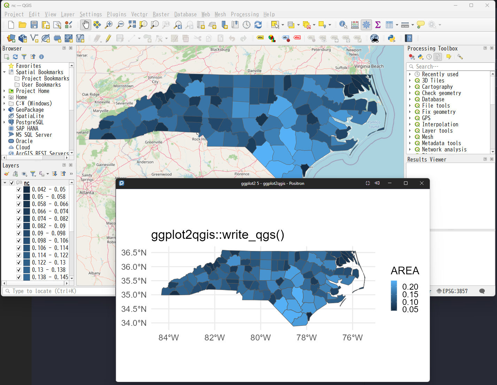

# ggplot2qgis

<!-- badges: start -->
[](https://github.com/yutannihilation/ggplot2qgis/actions/workflows/R-CMD-check.yaml)
[](https://yutannihilation.r-universe.dev/ggplot2qgis)
<!-- badges: end -->

Export a [ggplot2](https://ggplot2.tidyverse.org/) map plot (e.g. `geom_sf()`)
as a [QGIS](https://qgis.org/) project (`.qgs`) file.

`write_qgs()` takes a ggplot2 plot whose layers are backed by
[sf](https://r-spatial.github.io/sf/) objects and writes a QGIS project. The
data of each layer is saved as a GeoPackage alongside the `.qgs`, and each
layer is styled after the plot's trained color scale:

- a continuous `fill`/`colour` scale becomes a graduated renderer (or a
  continuously interpolated color, see `gradient_style`),
- a discrete scale becomes a categorized renderer,
- a layer with no `fill`/`colour` mapping becomes a single symbol with the
  color ggplot2 would have used.

## Installation

You can install ggplot2qgis via [R-universe](https://yutannihilation.r-universe.dev/ggplot2qgis):

``` r
install.packages("ggplot2qgis", repos = c("https://yutannihilation.r-universe.dev", "https://cloud.r-project.org"))
```

## Usage

``` r
library(ggplot2)
library(ggplot2qgis)

nc <- sf::st_read(system.file("shape/nc.shp", package = "sf"), quiet = TRUE)

p <- ggplot(nc) +
  geom_sf(aes(fill = AREA))

write_qgs(p, "nc.qgs")
```

Open `nc.qgs` in QGIS: the polygons are rendered with the same fill gradient
as the ggplot2 plot, and the data lives in `nc_data/`.

To add an XYZ tile basemap below the layers, pass `basemap` a predefined key
or an XYZ URL template:

``` r
write_qgs(p, "nc.qgs", basemap = "osm")
```



See `?write_qgs` for the full set of options (`use_plot_crs`,
`gradient_style`, `basemap`).

## TODOs

- [ ] Support labels
- [ ] Support tidyterra
  - [ ] vector
  - [ ] raster
- [ ] Support tmap
