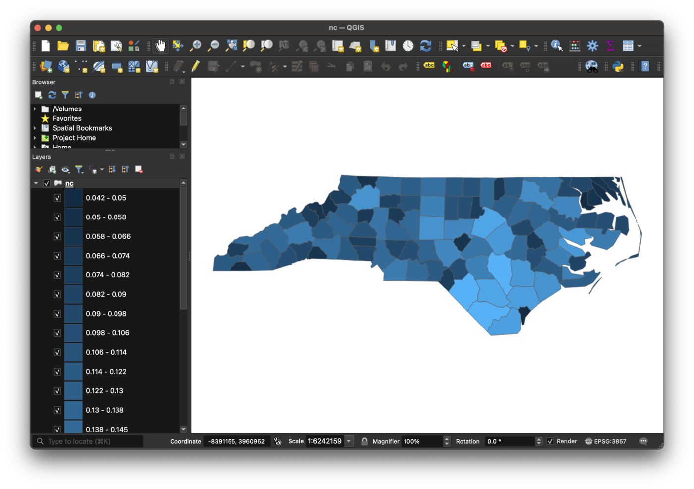
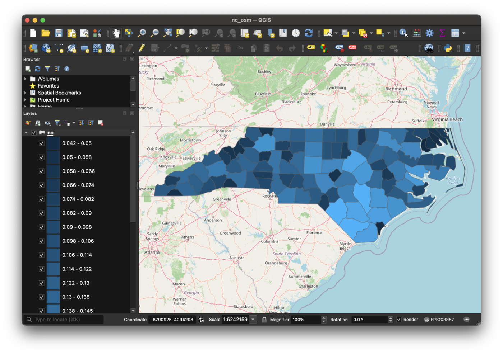
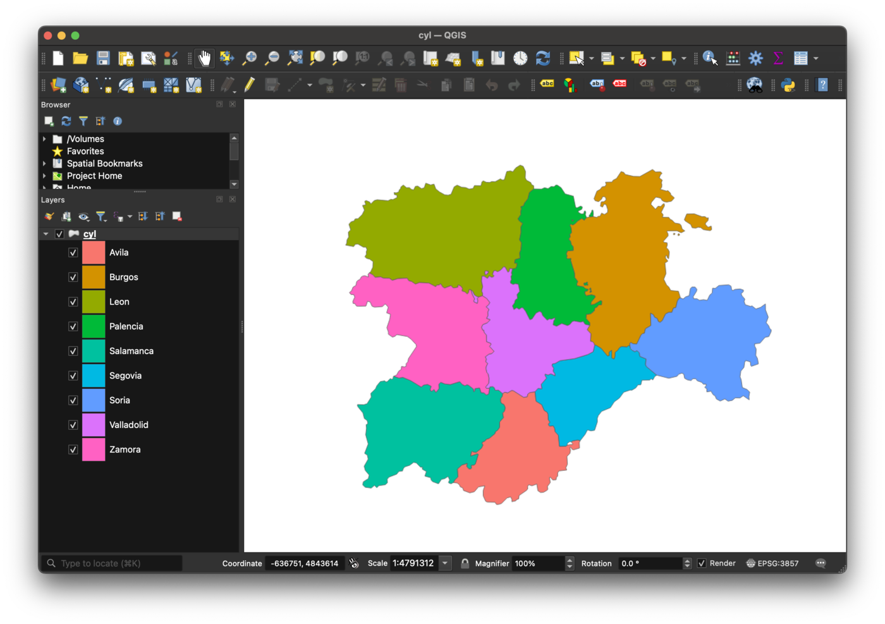
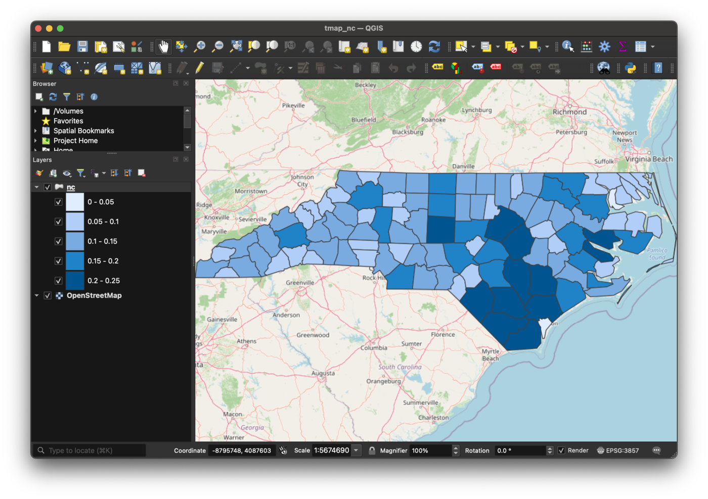
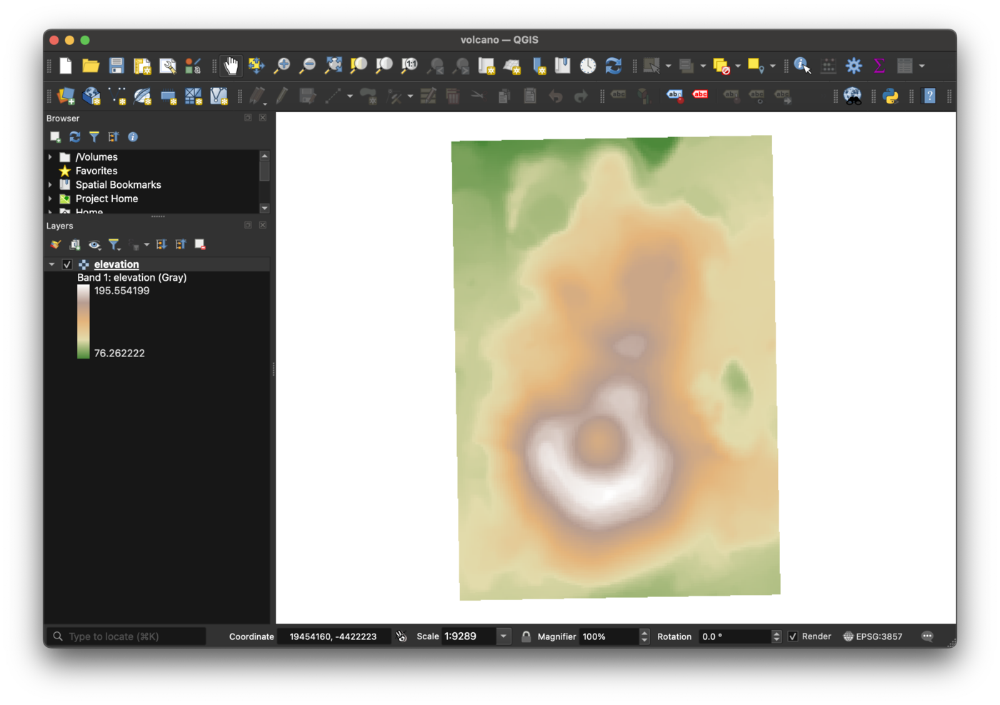
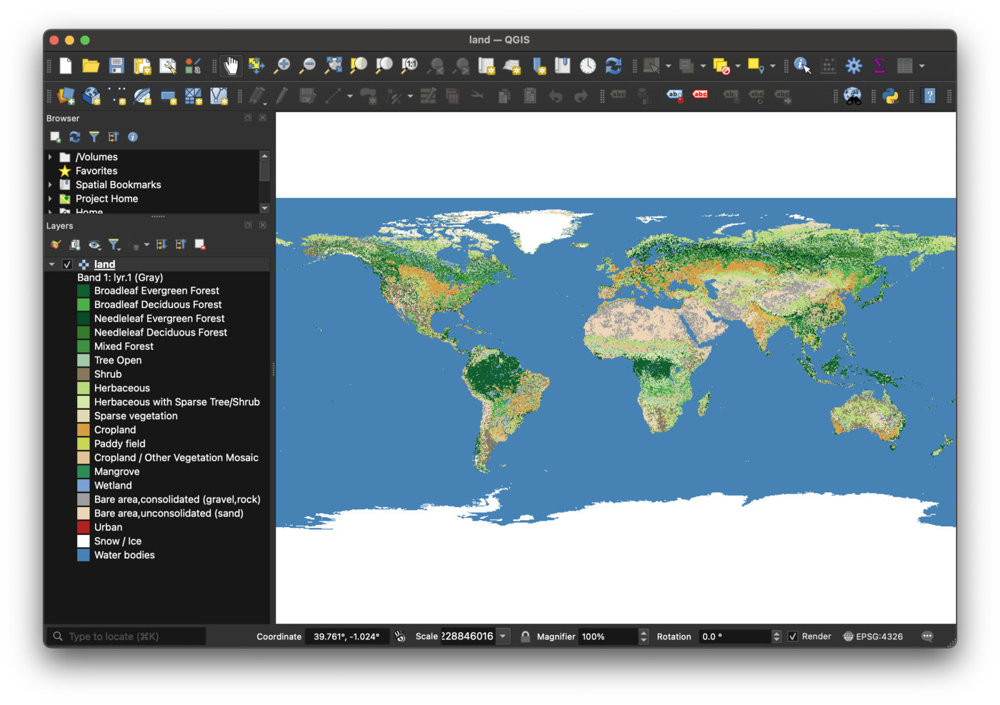

# ggplot2qgis

<!-- badges: start -->
[](https://github.com/yutannihilation/ggplot2qgis/actions/workflows/R-CMD-check.yaml)
[](https://yutannihilation.r-universe.dev/ggplot2qgis)
<!-- badges: end -->

Export a [ggplot2](https://ggplot2.tidyverse.org/) map plot (e.g. `geom_sf()`)
or a [tmap](https://r-tmap.github.io/tmap/) map as a
[QGIS](https://qgis.org/) project (`.qgs`) file.

`write_qgs()` takes a ggplot2 plot or a tmap object whose layers are backed
by [sf](https://r-spatial.github.io/sf/) objects (see *Vector* below) or by
rasters (see *Raster*) and writes a QGIS project. The data of each layer is
saved as a GeoPackage (a GeoTIFF for raster layers) alongside the `.qgs`,
and each layer is styled after the plot's trained color scale:

- a continuous `fill`/`colour` scale becomes a graduated renderer (or a
  continuously interpolated color, see `gradient_style`),
- a binned scale (e.g. `scale_fill_steps()`) becomes a graduated renderer
  with the scale's exact bins,
- a discrete scale becomes a categorized renderer,
- a layer with no `fill`/`colour` mapping becomes a single symbol with the
  color ggplot2 would have used.

## Installation

You can install ggplot2qgis via [R-universe](https://yutannihilation.r-universe.dev/ggplot2qgis):

``` r
install.packages("ggplot2qgis", repos = c("https://yutannihilation.r-universe.dev", "https://cloud.r-project.org"))
```

## Vector

A vector layer's data is saved as a GeoPackage table and the layer gets a
symbol renderer. Constant outline colors and widths, and constant line
types (`linetype` / `lty`), are carried over as well.

### ggplot2

`geom_sf()` on an [sf](https://r-spatial.github.io/sf/) object is the base
case:

``` r
library(ggplot2)
library(ggplot2qgis)

nc <- sf::st_read(system.file("shape/nc.shp", package = "sf"), quiet = TRUE)

p <- ggplot(nc) +
  geom_sf(aes(fill = AREA))

write_qgs(p, "nc.qgs")
```

Open `nc.qgs` in QGIS: the polygons are rendered with the same fill gradient
as the ggplot2 plot, and the data lives in `nc_data/`.

<p align="center">

</p>

To add an XYZ tile basemap below the layers, pass `basemap` a predefined key
or an XYZ URL template:

``` r
write_qgs(p, "nc.qgs", basemap = "osm")
```

<p align="center">

</p>

`geom_sf_text()` and `geom_sf_label()` become labels-only QGIS layers drawn
by QGIS's own labeling engine, and `geom_point()`, `geom_path()`,
`geom_line()` and `geom_polygon()` on a plain data frame are converted to
sf layers (the plot must use `coord_sf()`).

Beyond the colors, the constants ggplot2 computed for a layer are carried
over: `linewidth` and `linetype`, and on a point layer `size` / `stroke` as
the marker's size in millimeters, `shape` as the QGIS marker of the same
outline, and `alpha` as the alpha component of the colors ggplot2 applies it
to (a polygon's interior but not its border, a line's color, both colors of
a marker).

See `?write_qgs` for the full set of options (`use_plot_crs`,
`gradient_style`, `basemap`).

### tidyterra

[tidyterra](https://dieghernan.github.io/tidyterra/)'s `geom_spatvector()`
(and `geom_spatvector_text()` / `geom_spatvector_label()`) works too — they
are wrappers of `geom_sf()`, and tidyterra's `fortify()` method turns the
`SpatVector` into an sf object, so such a layer is styled by exactly the
same rules:

``` r
library(tidyterra)

cyl <- terra::vect(system.file("extdata/cyl.gpkg", package = "tidyterra"))

p <- ggplot(cyl) +
  geom_spatvector(aes(fill = name))

write_qgs(p, "cyl.qgs")
```

<p align="center">

</p>

### tmap

A [tmap](https://r-tmap.github.io/tmap/) (>= 4.4) object works the same way,
reproducing tmap's own trained color scales (`tm_scale_intervals()` with its
exact class boundaries, `tm_scale_categorical()`, `tm_scale_continuous()`) and
converting `tm_basemap()` to an XYZ tile layer:

``` r
library(tmap)

x <- tm_basemap("OpenStreetMap") +
  tm_shape(nc) +
  tm_polygons(fill = "AREA")

write_qgs(x, "nc_tmap.qgs")
```

<p align="center">

</p>

`tm_polygons()` / `tm_fill()` / `tm_borders()`, `tm_lines()` and the symbol
layers (`tm_symbols()` / `tm_dots()` / `tm_bubbles()` / `tm_squares()`, on
point shapes) are supported. Beyond the colors, the constants tmap computed
for the layer — `lwd`, `lty`, `size`, `shape`, `fill_alpha` and `col_alpha`
— are carried over: the marker size in millimeters, the pch translated to
the QGIS marker of the same outline, and the alphas as the alpha component
of the respective colors.

## Raster

A raster layer's data is written as a GeoTIFF next to the project, and
missing cells become the GeoTIFF's nodata value.

### tidyterra

`geom_spatraster()` becomes a single-band pseudocolor layer whose color ramp
reproduces the plot's continuous `fill` scale:

``` r
library(tidyterra)

volcano2 <- terra::rast(system.file("extdata/volcano2.tif", package = "tidyterra"))

p <- ggplot() +
  geom_spatraster(data = volcano2) +
  scale_fill_whitebox_c()

write_qgs(p, "volcano.qgs")
```

<p align="center">

</p>

`geom_spatraster_rgb()` becomes a multiband (true color) layer instead, with
the layer's `r`/`g`/`b` band selection, its `zlim`/`stretch` rescaling and
its constant `alpha` carried over.

`geom_spatraster_contour()` is the exception: it draws lines, so it becomes a
GeoPackage-backed line layer with one feature per contour line, keeping the
contour value as a `level` attribute. Mapping `colour` to
`after_stat(level)` renders it through the same scale machinery as a vector
layer:

``` r
p <- ggplot() +
  geom_spatraster(data = volcano2) +
  geom_spatraster_contour(data = volcano2, aes(colour = after_stat(level)))

write_qgs(p, "volcano_contour.qgs")
```

The raster becomes `elevation` and the lines `elevation_contour`.

`geom_spatraster_contour_filled()` becomes a polygon layer instead: one
feature per contour band, with the holes punched by the bands above it kept as
holes. Its `fill` is always the band the stat computed, so the layer gets a
categorized renderer keyed on the band label (`"(70, 80]"` and so on):

``` r
p <- ggplot() +
  geom_spatraster_contour_filled(data = volcano2) +
  geom_spatraster_contour(data = volcano2)

write_qgs(p, "volcano_bands.qgs")
```

The bands become `elevation_contour_filled` and the lines on top of them
`elevation_contour`.

`geom_spatraster_contour_text()` draws the same lines with their value written
along them, so it becomes that same line layer with QGIS labeling switched on.
The text is written as a `label` attribute, run through the geom's
`label_format` — so a custom format is reproduced as it is:

``` r
p <- ggplot() +
  geom_spatraster_contour_text(
    data = volcano2,
    label_format = scales::label_number(suffix = " m")
  )

write_qgs(p, "volcano_contour_text.qgs")
```

The layer becomes `elevation_contour_text`, labeled `"80 m"`, `"90 m"`, ... in
the geom's text size, font family and color. QGIS places each label on its
line and masks the line under it, reproducing the gap ggplot2 breaks there.
Mapping `colour` colors the lines through the same scale machinery as the
plain isolines, but a QGIS labeling has a single text color, so every label is
drawn in the first feature's, with a warning.

### tmap

`tm_raster()` on a raster shape (a stars object, a `SpatRaster` or a
`RasterLayer`) becomes a QGIS raster layer, with the classes, colors and
legend labels tmap trained — a discrete color ramp for
`tm_scale_intervals()`, a paletted renderer for a categorical one, an
interpolated ramp for `tm_scale_continuous()`:

``` r
library(stars)

data(land, package = "tmap")

x <- tm_shape(land) + tm_raster("cover")

write_qgs(x, "land.qgs")
```

<p align="center">

</p>

## TODOs

- Facets
  - [ ] `facet_wrap()` / `facet_grid()` and tmap's `tm_facets()`: write one
    layer per panel (named after the strip label) so that the panels can be
    compared in QGIS, e.g. side by side with QMapCompare. Today ggplot2
    facets are silently flattened into one layer per geom, and a faceted
    tmap object is an error.
- Vector
  - [ ] tmap's `tm_text()`
  - [ ] tmap's `tm_symbols()` / `tm_dots()` on polygon shapes (centroids)
  - [ ] an alpha a color carries itself (`colour = "#FF000080"`): only the
    `alpha` aesthetic and tmap's `fill_alpha`/`col_alpha` are carried over
- Raster
  - [ ] `geom_spatraster()` on a multi-layer SpatRaster (tidyterra facets
    by band, so one layer per band); the contour geoms on one too (they do
    not facet, so all bands' shapes would share a layer)
  - [ ] the label colors of a `geom_spatraster_contour_text()` layer whose
    `colour` is mapped: they need a data-defined text color (the renderer's
    classes as a QGIS expression) rather than the single one a QGIS
    labeling carries, so today they all take the first feature's color
  - [ ] tidyterra's color tables (`scale_fill_coltab()`)
  - [ ] tmap's `tm_rgb()` / `tm_rgba()`
